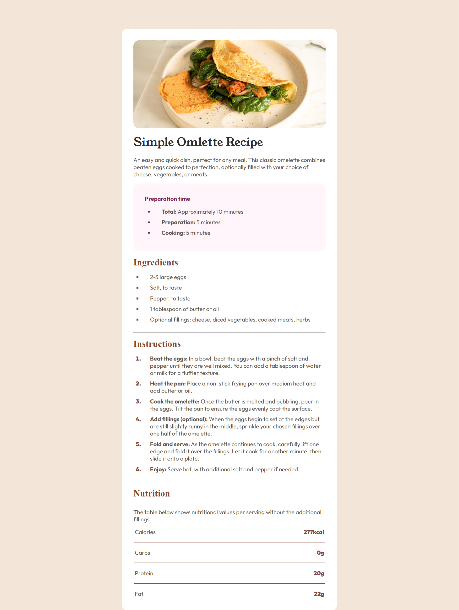

# Frontend Mentor - Recipe page solution

This is a solution to the [Recipe page challenge on Frontend Mentor](https://www.frontendmentor.io/challenges/recipe-page-KiTsR8QQKm).It's a beginner-friendly project focused on writing clean HTML and CSS.. 

## Table of contents

- [Overview](#overview)
  - [The challenge](#the-challenge)
  - [Screenshot](#screenshot)
  - [Links](#links)
- [My process](#my-process)
  - [Built with](#built-with)
  - [What I learned](#what-i-learned)
  - [Continued development](#continued-development)
  - [Useful resources](#useful-resources)
- [Author](#author)
- [Acknowledgments](#acknowledgments)

## Overview

### Screenshot




### Links

- Solution URL: [Add solution URL here](https://your-solution-url.com)
- Live Site URL: [Add live site URL here]((https://recipe-page-main-liart-ten.vercel.app/))

## My process

### Built with

- Semantic HTML5 markup
- CSS custom properties
- Flexbox

### What I learned

This challenge helped me practice structuring a clean HTML document and applying consistent styling with CSS. I also got more comfortable using Flexbox to center and space elements.


```html
<section class="ingredients">
                <h3> Ingredients</h3>
                <ul>
                    <li class="custom-bullet-ingredients"> 2-3 large eggs</li>
                    <li class="custom-bullet-ingredients">Salt, to taste</li>
                    <li class="custom-bullet-ingredients"> Pepper, to taste</li>
                    <li class="custom-bullet-ingredients"> 1 tablespoon of butter or oil</li>
                    <li class="custom-bullet-ingredients"> Optional fillings: cheese, diced vegetables, cooked meats, herbs</li>
                </ul>
            </section>
```
```css
tr:not(:last-child){
    border-bottom: 1.5px solid var(--Brown);
    padding-bottom: 1rem;
} 
```


### Continued development

Next, I’d like to:

Practice making layouts more responsive using media queries.

Improve my understanding of Flexbox alignment properties.

Try using CSS Grid in future projects.


### Useful resources

- MDN Web Docs

- Flexbox Froggy – A fun game that helped me understand Flexbox better.

## Author

 
- Frontend Mentor - [@Rhuqayah001](https://www.frontendmentor.io/profile/Rhuqayah001)


## Acknowledgments

I’d like to thank the Frontend Mentor community for creating beginner-friendly challenges that help me grow my frontend skills. Also, a big shoutout to everyone who shares helpful resources online — your tips and tutorials make learning so much easier!
